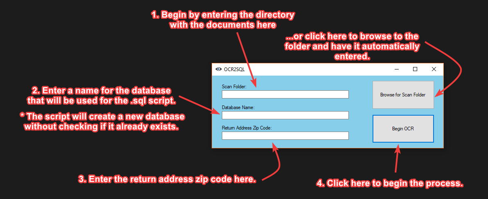
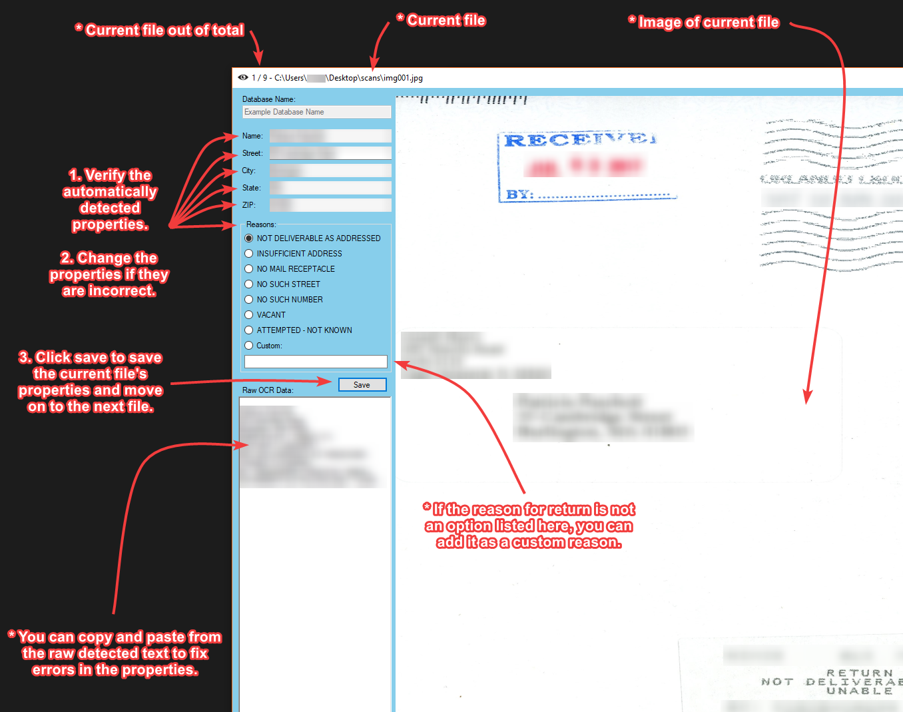

# OCR2SQL

Scans through returned mail and creates a database including the addresses and reasons for the return.

[Download setup from the releases page](https://github.com/Matrix-Guy/OCR2SQL/releases)

This likely has limited compatibility with other purposes than what I have used it for so feel free to submit an issue report and increased compatibility may be added.

## For Feature Suggestions and Bug Reports

Please use the [issues tracker on this github repository](https://github.com/Matrix-Guy/OCR2SQL/issues)!

## Current Features
* User gives scanned documents, the return address zip code, and a name of the database to be written.
* Scanned documents are converted into text one by one, allowing the user to see each scan and the estimated properties collected along with the raw detected text for easy fixing of matching errors.
* These are then written to a .sql file (SQL Script) which has all the matching data in it.

### Current Detected Properties 
1. Name
2. Street
3. City
4. State
5. ZIP Code
6. Reason for return

## Upcoming Features
* Better variable names
* Many more code comments
* Better detection of address patterns
* Loading screen instead of not responding
* OCR scan status in task bar

## Prerequisites

* Windows 7 SP1, Windows 8.1, or Windows 10 Anniversary Update OS
* [.NET Framework 4.7.1](https://www.microsoft.com/net/download/window)

## Installing and Deployment

[Download setup from the releases page](https://github.com/Matrix-Guy/OCR2SQL/releases)

or

1. Clone the repository.
2. Load the .sln in a C# compiler/IDE such as [Visual Studio](https://www.visualstudio.com/vs/) or [MonoDevelop](http://www.monodevelop.com).
3. Build the solution.
4. Run "OCR to SQL.exe".

Most editing you will want to do if any will take place in [Form1.cs](https://github.com/Matrix-Guy/OCR2SQL/blob/master/OCR%20to%20SQL/OCR%20to%20SQL/Form1.cs) and [Form2.cs](https://github.com/Matrix-Guy/OCR2SQL/blob/master/OCR%20to%20SQL/OCR%20to%20SQL/Form2.cs).

Happy forking!

## Users' Guide

1. Begin by entering the directory of the documents under "Scan Folder:", or click the button "Browse for Scan Folder", to browse to the folder and have it automatically entered.
2. Enter a name for the database under "Database Name:" that will be used for the .sql script. 
* The script will create a new database without checking if it already exists.
3. Enter the return address zip code under "Return Address Zip Code:".
4. Click the button "Begin OCR" to begin the process.

* You can see the current file out of the total amount in the title of the form.
* You can also see the current file location in the title of the form.
* You can see the image of the current file on the right of the form.
* You can see the database's name that you are currently saving to.
1. Verify the automatically detected properies under "Name:", "Street:", "City:", "State:", "ZIP:", and the reasons inside the box labeled "Reasons:".
2. Change the properties if they are incorrect.
* You can copy and paste from the raw detected text to fix errors in the properties.
* If the reason for return is not an option listed in the "Reasons:" box, you can add it as a custom reason under "Custom:".
3. Click save to save the current file's properties and move on to the next file.
4. After going through all files, you can find the .sql script in the same directory as the documents.
* The information of each document is saved each time you click the button "Save", so if the program hits an exception, crashes, or for some reason ends, you should still have your already collected information in an .sql file in the same directory of the documents.

## Built With

* [C#](https://en.wikipedia.org/wiki/C_Sharp_(programming_language)) - The .Net Framework language
* [Tesseract NuGet](https://github.com/charlesw/tesseract) - The NuGet version of tesseract
* [Tesseract](https://github.com/tesseract-ocr/) - The official tesseract

## Contributing

Submit an issue tracker or a pull request and someone will get back to you.

## Authors

* **Cody Neiman** - *AKA* - [Matrix-Guy](https://github.com/Matrix-Guy)

Any future collaborators will be added here.

## License

This project is licensed under the GNU GENERAL PUBLIC LICENSE (Version 3, 29 June 2007) - see the [LICENSE](LICENSE) file for details.